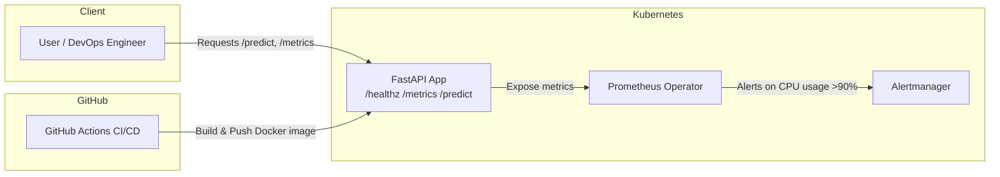

# CPU Anomaly AIOps Stack

This project is a minimal end-to-end AIOps demo with FastAPI, Prometheus metrics, CPU anomaly alerting, and drift retraining.

## Features
- 🚦 FastAPI service with `/healthz`, `/metrics`, `/predict` endpoints
- 📊 Prometheus-compatible metrics (`cpu_usage_percent`)
- ⚡ CPU anomaly detection alerts when usage >90% for 5+ minutes
- 🔁 Retrain-on-drift placeholder for future model updates
- 🐳 Docker + Kubernetes deployment ready
- 🤖 GitHub Actions workflow to auto-build & push Docker images

---

## Quickstart (Local)

```bash
python3 -m venv venv
source venv/bin/activate
pip install -r requirements.txt
uvicorn main:app --host 0.0.0.0 --port 8000 --reload
```

- Swagger UI: [http://localhost:8000/docs](http://localhost:8000/docs)  
- Healthcheck: [http://localhost:8000/healthz](http://localhost:8000/healthz)  
- Metrics: [http://localhost:8000/metrics](http://localhost:8000/metrics)

---

## CPU Alert Simulator

Run anomaly detection on a JSONL log stream:

```bash
python -c "from cpu_alert import check_alert, stream; check_alert(stream(open('cpu.jsonl')))"
```

You should see alerts and metrics push confirmations.

---

## Docker

```bash
docker build -t anomaly:v0.1.1 .
docker run -p 8000:8000 anomaly:v0.1.1
```

---

## Kubernetes

```bash
kubectl apply -f deploy.yaml
kubectl get pods
kubectl port-forward service/anomaly-service 8000:8000
```

Test:
```bash
curl http://localhost:8000/healthz
```

---

## Prometheus & Alerting

- Apply `servicemonitor.yaml` to scrape `/metrics`  
- Apply `prometheus-rules.yaml` to alert on high CPU usage (>90% for 5m)  
- Alerts flow into **Alertmanager** (configure routes e.g., Slack/email)

---

## ✅ Verification Checklist

### 1. Local Development
- [ ] Run `uvicorn main:app --port 8000 --reload`
- [ ] `/healthz`, `/metrics`, `/predict` return correct responses
- [ ] `cpu_alert.py` detects anomalies using `cpu.jsonl`

### 2. Docker
- [ ] Build image `anomaly:v0.1.1`
- [ ] Run with `docker run -p 8000:8000 anomaly:v0.1.1`
- [ ] Test endpoints inside container

### 3. Kubernetes
- [ ] Deploy with `kubectl apply -f deploy.yaml`
- [ ] Pods in `Running` state
- [ ] Port-forward service → verify `/healthz`, `/metrics`

### 4. Prometheus
- [ ] `ServiceMonitor` applied
- [ ] Target `anomaly-service` is `UP`
- [ ] `cpu_usage_percent` visible in Prometheus

### 5. Alertmanager
- [ ] `PrometheusRule` applied
- [ ] `HighCPUUsage` alert fires on sustained load
- [ ] Alert routes to configured channel (Slack/email)

### 6. CI/CD
- [ ] Commit and push → GitHub Actions builds/pushes Docker image
- [ ] Deployment updated to pull image from registry

---

## 📊 Architecture Diagram



---

## License
MIT (or add your own)
